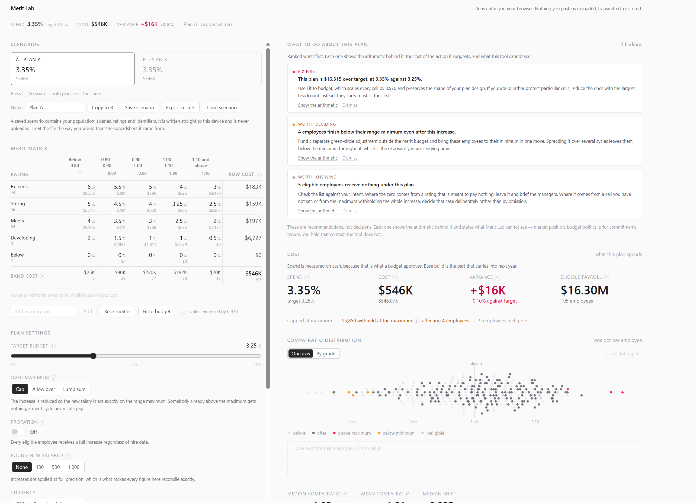

# Merit Lab

A merit matrix and budget simulator that runs entirely in your browser.

**[compforyou.github.io/merit-lab](https://compforyou.github.io/merit-lab/)**

> **Every figure in this repository is synthetic.** The sample population, the salary
> structure and the merit matrix are all generated by code in `src/data/`, from a fixed
> seed. No real employee data has ever been in this repository, and none ever will be.



---

## What it is for

A compensation analyst designing an annual merit cycle usually works in a spreadsheet
that is rebuilt from scratch every year, is never tested, and cannot be handed to a
colleague. That spreadsheet answers one question well: **what does this cost.**

It does not answer the questions that follow:

- What does this do to my compa-ratio distribution?
- How many people does it push over their range maximum?
- Who is still below their minimum when it is finished?
- How much compression does it create between my grades?
- What did the money actually buy?

Merit Lab answers all of those, and recomputes every one of them on every keystroke.

## Why it runs in your browser

Nobody in compensation is permitted to upload pay data to a stranger's website. So this
app never receives it.

There is no server, no account, no database and no analytics. Everything happens in the
browser tab. If you want to keep a scenario, you export a file to your own disk.

That constraint is not a feature bolted on for reassurance — it is the reason a comp team
can adopt the tool without asking anyone's permission.

**What is kept, precisely.** Your population is never written anywhere: not to disk, not
to storage, not to a log. Close the tab and the people are gone. Your *plan design* — the
matrix percentages, band boundaries, rating labels, target budget and settings, none of
which contain anybody's pay — is kept in browser storage on your own device, so that an
accidental refresh does not cost you an afternoon's work. Nothing is written at all until
you change something, and one click in the footer erases it.

That split is the whole design: the population is cheap to restore and expensive to
store, and the matrix is the opposite.

## Getting your file in

An HRIS extract does not have a column called "base salary". It has `Curr_Ann_Base_Amt`
next to `Prev_Ann_Base_Amt`, and a `Level` column that means job family rather than grade.

Merit Lab matches what it recognises and then shows you the mapping, with three real rows
of your own data underneath each field so you can see what it will read — including the
interpretations that are not guessable, like an FTE of `50` meaning half time and
`03/04/2024` being read day-first. Anything it could not match, you point at the right
column yourself. Nothing needs renaming first.

It also checks the data underneath the mapping and says so when the two disagree: a
salary column holding four repeating words, an employee id that repeats, an eligibility
column with five values. A column matched by name alone — `Pay`, `Level`, `Band` — is
flagged for confirmation rather than accepted quietly, because a wrong column still
produces a budget, a distribution and a recommendation, all of them wrong and none of them
obviously so.

## The maths

`src/lib/` is the heart of the project. Every function in it takes numbers in and returns
numbers out, with no dependency on the interface, and every compensation formula has a
unit test with a hand-calculated expected value.

| File | Formula |
|---|---|
| `compa-ratio.ts` | `fullTimeEquivalentSalary / gradeMidpoint` |
| `range-penetration.ts` | `(salary − min) / (max − min)`, never clamped |
| `range-spread.ts` | `(max − min) / min` |
| `midpoint-progression.ts` | `(mid − midBelow) / midBelow` |
| `compa-ratio-bands.ts` | Band assignment, lower bound inclusive |
| `proration.ts` | `completedWholeMonths / 12` |
| `merit-increase.ts` | Per-employee increase, three over-maximum modes |
| `budget.ts` | Eligible payroll, base build, lump sum, total spend, variance |
| `distribution.ts` | Post-cycle compa-ratio shift and crossings |
| `compression.ts` | Adjacent-grade differentials |
| `insights.ts` | Increase distribution, cost drivers, cost per point of movement |
| `advisor.ts` | Ranked findings, each with its arithmetic and its cost |
| `column-mapping.ts` | Which column is which, and whether the data underneath agrees |
| `session-memory.ts` | What is kept between visits, and the guard that keeps pay out of it |
| `sensitivity.ts` | The same plan rescaled onto other budgets, and where a target is unreachable |
| `inversions.ts` | Where a better rating received fewer dollars |
| `rating-governance.ts` | Rating distribution by group against the company |
| `plan-brief.ts` | The one-page brief, as a standalone document |

**694 tests.** The deployment runs them before publishing, so a broken formula cannot
reach the live URL.

If you want to check whether this tool knows what it is doing, read
[`src/lib/compa-ratio.ts`](src/lib/compa-ratio.ts) and its test. That is the fastest way
to find out.

## Defending the plan

Designing the matrix takes an afternoon. Defending it takes six weeks and a dozen
meetings, and that is where the questions arrive live, with people waiting:

**"What does 3.0% look like? We're deciding today."** One table, one row per candidate
budget, each rescaling your matrix and costing the whole population against it — with
what it does to the median, who gets capped, and who is still below their minimum. Where
a target cannot be reached at all, it says so: under capping the population physically
cannot absorb more money, and a plan that silently misses its target looks like a tool
that does not work.

**"My top performer got $2,100 and the guy who coasts got $2,800."** A matrix pays a
percentage, and a percentage of a larger salary is more money — so within a grade it can
reverse the order the ratings intended. In the sample population, a Strong employee at
$184,500 receives $571 less than a Meets employee at $148,100. Nobody builds this pivot,
because nobody suspects it is there; every manager notices it. Part-time employees are
left out, and the count said: they receive a share of a full increase, so the comparison
is not like for like.

**"Why is this team's spend so high?"** Rating distribution by group against the company
figure, so a department calling 40% of its people top-box against a company 23% is
visible before somebody else finds it. Groups under five people show counts but not
shares. It describes what managers did; it is not evidence anybody did anything wrong.

## Getting the thinking out

A results CSV carries every intermediate value **and the settings that produced it** —
plan name, target, over-maximum mode, proration, rounding, currency, timestamp — repeated
on every row so the file stays a plain rectangle any tool reads. Rating, band and matrix
percentage per row rebuild the matrix itself. A file nobody can reproduce cannot be
audited, and audit is half of why the export exists.

**One-page brief** produces a standalone HTML document: the headline figures, the matrix,
what it does to the population, the ranked findings with their arithmetic and their costs,
and the budget sensitivity table. It opens in any browser and prints straight to PDF.
Before it existed, the only way to show a colleague what this tool concluded was a
screenshot — at exactly the moment the work was supposed to pay off.

## Decisions worth knowing about

These were settled before any code was written, and each one changes the numbers.

**Base salary is actual pay at the employee's FTE.** Range placement grosses it up to
full time, so a 0.5 FTE employee is compared against the same midpoint as everyone else.
Cost and eligible payroll use actual pay. Getting this backwards makes every part-timer
look severely green-circled and quietly pulls budget toward them.

**Cost is reported twice.** Total spend is cash out the door this cycle, because that is
what a budget approves. Base build is the part that compounds into next year's payroll.
They differ only in lump sum mode, which is exactly where a single figure would mislead.

**An employee who cannot be costed is never treated as a zero.** No grade, no midpoint,
no matching band or no matrix row means they are excluded from eligible payroll *and*
reported by name. Folding them into the denominator would understate the spend percentage
while looking entirely normal.

**Under capping, an employee already above the maximum receives nothing.** A merit cycle
never cuts pay, and the money the matrix would have paid is reported as withheld rather
than silently disappearing.

**Compa-ratio bands are inclusive at the lower bound.** Someone at exactly 1.00 sits at
the bottom of the 1.00–1.10 band, not the top of 0.90–1.00. That moves real money.

**Grades carry an explicit order.** Inferring the hierarchy from midpoints breaks on
parallel job families, and an inferred hierarchy cannot be audited.

**Nothing is rounded until display.** Rounding mid-calculation produces budget variances
practitioners notice and distrust. Rounding new salaries to a whole increment is available
as an explicit setting, off by default, because it changes the cost.

## A worked example

[`docs/WORKED-EXAMPLE.md`](docs/WORKED-EXAMPLE.md) walks through the sample population
from load to a fitted budget, with every figure you should see on screen. It takes about
ten minutes and needs nothing but a browser.

## Running it yourself

```bash
npm install
npm run dev
```

Other commands:

```bash
npm test
```

```bash
npm run build
```

## Stack

Vite, React and TypeScript, Tailwind for styling, Vitest for tests, GitHub Pages for
hosting. The dot plot is hand-written SVG rather than a charting library: each dot has to
be a persistent object that moves between states, which is not what a charting library
does.

## Specification

[`docs/SPEC.md`](docs/SPEC.md) is the product spec the tool was built from — the domain
glossary, the compensation formulas as stated, the build order, and the interaction rules.
It was written before the first line of code.
